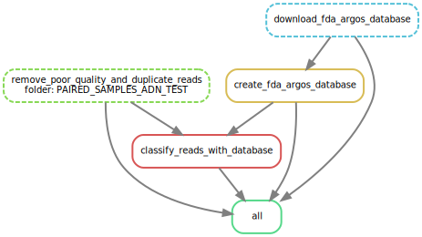

# CLINICAL METAGENOMICS
[](https://clinical-metagenomics.readthedocs.io/fr/latest/?badge=latest)

## Introduction

La métagénomique clinique permet la recherche large de pathogènes dans un échantillon clinique. Cette technique de diagnostic repose sur l’utilisation du séquençage haut-débit pour séquencer l’ensemble du matériel génétique présent dans un échantillon. Avec le grand nombre de données générées que ce soit au niveau de la création des bases de données de références ou de l'analyse des résultats, la métagénomique clinique nécessite le développement d'outils et de pipeline de bio-informatique adaptés à la détection des pathogènes.

## Source

Dans ce cadre, le projet s'inspire du travail fourni à l'origine par Antoine. L disponible à l'adresse suivante [gitlab](https://gitlab.com/a_laine/metagenomic-pipeline).

## Configurations

### Environnement conda :metal:
Conda est un gestionnaire de paquets, il permet de créer son propre environnement
virtuel contenant les logiciels informatiques nécessaires au fonctionnement du pipeline de métagénomique (exemple Kraken 2, la suite BLAST + etc...).
Pour créer un environnement conda à partir du fichier yaml (metagenomic_env.yml) :

```bash
conda env create -f metagenomic_env.yml
```

Pour activer l'environnement conda :

```bash
conda active metagenomic_env
```

Pour désactiver l'environnement conda :

```bash
conda deactivate
```

Pour supprimer l'environnement conda :

```bash
conda env remove -n metagenomic_env
```

Pour actualiser les modifications dans l'environnement conda :

```bash
conda env update --name metagenomic_env --file metagenomic_env.yml 
```

### Automatisation avec SnakeMake :snake:
[Snakemake](https://snakemake.readthedocs.io/en/stable/) est un outil particulièrement adapté au développement de pipelines et permet des analyses de données reproductibles. Ecrit en Python, il suit le principe de règles définies par plusieurs paramètres comme les fichiers d’entrées, et un ou plusieurs fichiers de sorties. Les règles sont écrites dans un fichier appelé « SnakeFile ». 

Pour exécuter snakemake assurez vous d'avoir activé l'environnement conda :

```bash
conda activate metagenomic_env
```

Pour tester si le pipeline marche sans bug :

```bash
snakemake -np
```

Pour exécuter le pipeline sur un cluster avec une puissance de 30 CPU :

```bash
snakemake --cores 30
```

Pour créer un graphique complet du pipeline :

```bash
snakemake --dag | dot -Tsvg > results/plots/dag.svg 
```

Ce qui nous donne :



## Documentation :book:

La documentation se trouve dans le lien suivant :

   * https://clinical-metagenomics.readthedocs.io/fr/latest/

### Configuration de la documentation

La documentation utilise [sphinx](https://www.sphinx-doc.org/en/master/) et le thème "sphinx-rtd-theme" que l'on peut retrouver sur https://github.com/readthedocs/sphinx_rtd_theme.

Le thème peut etre facilement activé avec l'environnement conda ci-dessus.

## Architecture du programme 

L'architecture du projet dans le cluster est la suivante :

```bash
.
├── data
│   ├── assembly
│   ├── databases
│   ├── raw_sequences
│   ├── reads
│   └── taxonomy
├── docs
│   ├── build
│   ├── make.bat
│   ├── Makefile
│   └── source
├── metagenomic_env.yml
├── README.md
├── results
│   ├── classify_reads
│   ├── logs
│   ├── plots
│   └── trimmed_reads
├── run_snakefile_cluster.sh
├── Snakefile
└── src
    ├── bash
    ├── download
    ├── python
    └── r
```

Cette architecture s'inpire de la méthode décrite dans l'article suivant :

   * Noble, W. S. A Quick Guide to Organizing Computational Biology Projects. PLOS Computational Biology 5, e1000424 (2009).

## Objectifs

- [ ] Inclure un quickstart guide.
- [x] Inclure un fichier README.md
- [x] Documenter mon code (avec Sphinx) (en cours).
- [x] Inclure des exemples.
- [x] Ajouter l'option -h ou help commande pour chaque fichier bash.

Objectifs inspirés par l'article suivant :

   * Lee BD (2018) Ten simple rules for documenting scientific software. PLoS Comput Biol 14(12): e1006561. https://doi.org/10.1371/journal.pcbi.1006561

