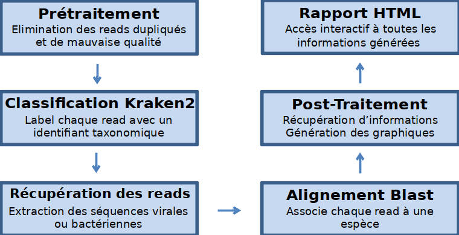

# CLINICAL METAGENOMICS
[](https://clinical-metagenomics.readthedocs.io/fr/latest/?badge=latest) [](https://raw.githubusercontent.com/Zygnematophyce/CLINICAL_METAGENOMICS/master/docs/build/latex/clinicalmetagenomics.pdf)

## Introduction

La métagénomique clinique permet la recherche à large spectre de pathogènes dans un échantillon. Cette technique de diagnostic repose sur le séquençage de l’ensemble du matériel génétique présent dans un échantillon grâce aux technologies de séquençage nouvelles génération (NGS) . Avec le grand nombre de données générées que ce soit au niveau de la création des bases de données de références ou de l'analyse des résultats, la métagénomique clinique nécessite la mise en relation d'outils de bio-informatique et d'un pipeline adaptés à la détection des pathogènes.

### Le point de départ

Dans ce cadre, le projet s'inspire du travail fourni à l'origine par Antoine. L disponible à l'adresse suivante [gitlab](https://gitlab.com/a_laine/metagenomic-pipeline).

## Schéma des étapes du pipeline



## Lancer le pipeline

Pour lancer le pipeline, activez l'environnement conda.

```bash
conda activate metagenomic_env
```

Ensuite, lancer la commande suivante en indiquant le dossier contenant les reads.
```bash
bash pipeline.sh -path_reads data/reads/exemple/
```

## Documentation :book:

Une documentation a été créée dans le but d'avoir une référence et un support consultable sur l'ensemble du travail fournit, elle peut être visionnée avec le lien suivant :

   * https://clinical-metagenomics.readthedocs.io/fr/latest/

## Architecture du projet 

L'architecture du projet est la suivante :

```bash
.
├── data
│   ├── assembly
│   ├── databases
│   ├── raw_sequences
│   ├── reads
│   └── taxonomy
├── docs
│   ├── build
│   ├── make.bat
│   ├── Makefile
│   └── source
├── metagenomic_env.yml
├── README.md
├── results
│   ├── 16_09_2020_14h_50m_00s
│   ├── logs
├── Snakefile
└── src
    ├── bash
    ├── download
    ├── old_sources
    ├── python
    ├── r
    └── report
```

Cette architecture s'inspire de la méthode décrite dans l'article suivant :

   * Noble, W. S. A Quick Guide to Organizing Computational Biology Projects. PLOS Computational Biology 5, e1000424 (2009).

## Objectifs

- [x] Inclure un quickstart guide.
- [x] Inclure un fichier README.md
- [x] Documenter mon code (avec Sphinx) (en cours).
- [x] Inclure des exemples.
- [x] Ajouter l'option -h ou help commande pour chaque fichier bash.

Objectifs inspirés par l'article suivant :

   * Lee BD (2018) Ten simple rules for documenting scientific software. PLoS Comput Biol 14(12): e1006561. https://doi.org/10.1371/journal.pcbi.1006561
