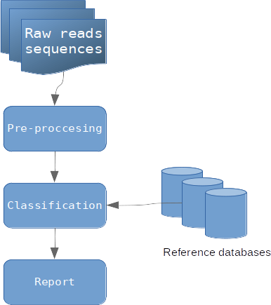

Vue d'ensemble
##############

Simple organigramme des étapes de métagénomique clinique (image par Zygnematophyce)

Étape de prétraitement
-----------------------

L’étape de prétraitement (ou pre-processing en anglais) est nécessaire avant toute analyse. Cette étape consiste à éliminer les séquences de mauvaise qualité et les séquences dupliquées à partir des fichiers fastq de reads bruts (raw reads sequences) issus du séquençage. Cette étape permet de réduire la quantité d’informations à traiter, et d’éliminer les informations redondantes. Vous pouvez utiliser le programme construit à cette occasion dans la session :ref:`le prétraitement des reads <pre_processing>` du tutoriel. 

Création des bases de données de références
-------------------------------------------

Avant de classifier les reads, il est indispensable de créer des bases de données de référence pour identifier un organisme. Au total, 4 bases de données ont été créées :

La base de données FDA-ARGOS
~~~~~~~~~~~~~~~~~~~~~~~~~~~~

FDA-ARGOS est une base de données génomique, curée, et publique. Cette base de
données est construite à des fins de diagnostic clinique. FDA-ARGOS applique des mesures de qualité sur les séquences de pathogènes qui la composent. Ces mesures de qualité sont basées par exemple sur des critères tels que l’assemblage du génome avec une couverture de 95% couplé à d’autres critères.

Au final la base de données FDA-ARGOS est composée à la date de décembre 2019 de 487 isolats avec 88,3% de bactéries, 11,1% des virus et 0,6% d’eucaryotes, représentant 189 taxons différents avec au total 81,9% des génomes d'origine clinique et les 8,1% restants de génomes environnementaux.

Pour télécharger la base de données FDA-ARGOS utiliser le programme construit décrit dans la session :ref:`le téléchargement de la base de données FDA-ARGOS <download_FDA_ARGOS>` du tutoriel. 

La base de données Mycocosm
~~~~~~~~~~~~~~~~~~~~~~~~~~~

La base de données Mycocosm est un projet de génomique fongique du Joint Genome Institute (JGI) qui s'est associé à la communauté scientifique internationale pour soutenir l'exploration génomique des champignons.

Aujourd’hui le portail propose plus de 1000 espèces fongiques et plus de 500 familles fongiques.

Pour télécharger la base de données de Mycocosm, utiliser le programme construit décrit dans la session :ref:`le téléchargement de la base de données Mycocosm <download_Mycocosm>` du tutoriel. 

La base de données FungiDB
~~~~~~~~~~~~~~~~~~~~~~~~~~

FungiDB (fungidb.org) est une ressource en ligne gratuite pour l'exploration de données et l'analyse génomique fonctionnelle des espèces fongiques et oomycètes. FungiDB contient un nombre croissant de génomes de divers taxons, y compris des plantes, des animaux et des pathogènes humains.

Pour télécharger la base de données de FungiDB utiliser le programme construit décrit dans la session :ref:`le téléchargement de la base de données FungiDB <download_FungiDB>` du tutoriel. 

La base de données RefSeq
~~~~~~~~~~~~~~~~~~~~~~~~~

La base de données RefSeq comprend plus de 220 000 organismes (Jul, 2020) avec des génomes viraux et bactériens.

   * Pour les virus, la base de données « viral » de RefSeq a été choisie : elle est composée des génomes complets d’environ 10 000 espèces virales (Jul 06, 2020) et apparait adaptée pour couvrir la grande majorité des virus rencontrés dans un échantillon clinique.
   * Pour les bactéries, l’utilisation d’une base de données de génomes complets comme « bacteria » de RefSeq est composée de 62 000 espèces bactériennes (Jul 06, 2020).

Pour télécharger la base de données de RefSeq utiliser le programme construit décrit dans la session :ref:`le téléchargement de la base de données RefSeq <download_RefSeq>` du tutoriel.

.. note::
   Les chiffres officiels pour chaque taxon sont visibles sur le lien suivant : ftp://ftp.ncbi.nlm.nih.gov/refseq/release/release-statistics/ .

Étape de classification
-----------------------

La classification taxonomique est une étape cruciale de la métagénomique. Plusieurs algorithmes et outils permettent d’identifier les organismes. L’outil le plus connu est sans doute l’algorithme de BLAST. Cependant, BLAST est un outil qui demande beaucoup de ressource, et prend du temps d’exécution lorsqu’il s'agit de comparer un read à l’ensemble d’une base de données. Pour identifier plus rapidement les reads, une solution alternative est proposée par l’outil Kraken 2 qui utilise l’algorithme des k-mers. L'algorithme de k-mer va hacher les reads et les séquences dans les bases de données en fragment de nucléotide. Avant d'identifier un organisme, Kraken 2 va indexer la base de données en associant un identifiant taxonomique aux k-mer d'une base de données. Enfin pour classifier des reads, Kraken 2 compare l'association exacte des k-mers d'un read à ceux d'une base de données et détermine l'identifiant taxonomique associé.

Pour indexer une base de données avec l'algorithme de k-mer utiliser le programme décrit dans la session :ref:`l'indexation d'une base de données avec Kraken 2 <indexation_kraken2>` du tutoriel.

Pour classifier un échantillon de reads par rapport à une base de données utiliser le programme décrit dans la session :ref:`Classification des reads avec Kraken 2 <classification_kraken2>` du tutoriel. 

Étape d'analyse des résultats
-----------------------------
