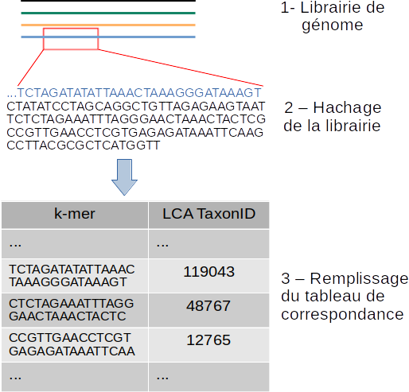
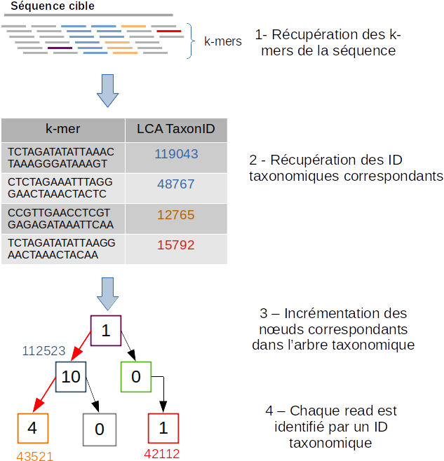

Tutoriel
########

Ci-dessous vous pouvez trouver le tutoriel sur comment utiliser le pipeline de métagénomique clinique.

.. contents::
   :depth: 2

.. _pre_processing:

.. warning::
   Dans la majorité des programmes présentés dans les sessions suivantes du tutoriel, il est possible de consulter les paramètres précis d'un programme en ajoutant la comme :-h: pour help comme illustré ci-contre ::
   <programe> -h

Le pré-traitement des reads
---------------------------

L'exemple suivant nous montre comment utiliser les étapes de pré-traitement.

Programme
~~~~~~~~~

Nom du programme::

   remove_poor_quality_duplicate_reads_preprocess.sh

Localisation
~~~~~~~~~~~~

.. code-block:: sh

   └── src
    ├── bash
    │   ├── remove_poor_quality_duplicate_reads_preprocess.sh

Les outils utilisés
~~~~~~~~~~~~~~~~~~~

:Clumpify.sh: Le script Clumpify.sh de l’aligneur BBMap permet d’identifier les séquences identiques en sortie de séquençage. Configuré avec le paramètre Dedupe le script clumpify, fait intervenir le logiciel Dedupe de la suite BBMap pour éliminer les reads dupliqués.

:Dedupe: Dedupe supprime les reads dupliqués.

:Trimmomatic: Trimmomatic permet de supprimer les reads de mauvaises qualités c'est à dire les reads qui ont un score phread (score de qualité) moyen d'au moins 20 et des reads de taille minimum de 50 nucléotides pour avoir assez d'information pour classifier les reads.

Exemple d'utilisation
~~~~~~~~~~~~~~~~~~~~~

.. code-block:: sh

   bash src/bash/remove_poor_quality_duplicate_reads_preprocess.sh \
                -path_reads data/reads/PAIRED_SAMPLES_ADN_TEST/ \
                -path_output results/trimmed_reads/trimmed_PAIRED_SAMPLES_ADN_TEST_reads_04_06_2020/ \
                -threads 28

Dans cet exemple, nous indiquons le dossier contenant les reads et nous précisons le dossier de sortie pour lequel les reads sortirons traités et filtrés. Nous pouvons préciser le nombre de threads pour accélérer le traitement, ici le nombre de thread est à 28.

Les paramètres
~~~~~~~~~~~~~~

:-path_reads: (Input) Le chemin du dossier avec l'ensemble des reads.

:-path_outputs: (Output) Le chemin du dossier de sortie des reads pré-traités. 

:-threads: (Input) Le nombre de thread (par défaut configuré à 1 thread).

:-force_remove: (Optionnel) Par défaut la valeur est sur "yes" et permet de supprimer les fichiers intermédiaires. Pour ne pas supprimer les fichiers intermédiaires configurer le paramètre avec la valeur "no" comme avec l'exemple ci-contre :

.. code-block:: sh

   bash src/bash/remove_poor_quality_duplicate_reads_preprocess.sh \
                -path_reads data/reads/PAIRED_SAMPLES_ADN_TEST/ \
                -path_output results/trimmed_reads/trimmed_PAIRED_SAMPLES_ADN_TEST_reads_04_06_2020/ \
                -force_remove no \
                -threads 28

Les fichiers de sorties
~~~~~~~~~~~~~~~~~~~~~~~

   * Avec l'outil Trimmomatic :

::

   <name_of_read>_trimmed.fastq.gz  

**<name_of_read>_trimmed.fastq.gz** correspondent aux reads qui ont correctement répondu aux conditions de filtrage.

::

   <name_of_read>_unpair_trimmed_fastq.

**<name_of_read>_unpair_trimmed_fastq.gz** correspondent aux reads qui n'ont pas correctement répondu aux conditions de filtrage.

   * Avec l'outil Clumpify.sh et Dedupe:

::

   <name_of_read>_depupe.fastq :

**<name_of_read>_depupe.fastq** est le résultat des outils Clumpify.sh et Dedupe pour les reads.

::

   <name_of_read>_info.txt

**<name_of_read>_info.txt** contient le nombre de reads totaux.

.. _download_FDA_ARGOS:

Le téléchargement de la base de données FDA-ARGOS
-------------------------------------------------

La session suivante, nous montre comment télécharger la base de données FDA-ARGOS.

Programme
~~~~~~~~~

Nom du programme::

   download_fda_argos_assembly.sh

Localisation
~~~~~~~~~~~~

.. code-block:: sh

   └── src
    ├── download
    │   ├── download_fda_argos_assembly.sh

Exemple d'utilisation
~~~~~~~~~~~~~~~~~~~~~

.. code-block:: sh

   bash src/download/download_fda_argos_assembly.sh \
                    -assembly_xml data/assembly/assembly_fda_argos_ncbi_result.xml \
                    -path_output data/raw_sequences/fda_argos_assembly_raw_sequences/

Dans cet exemple, nous téléchargeons les séquences assemblées de FDA-ARGOS à l'aide d'un fichier XML présent dans le dossier data/assembly/assembly_fda_argos_ncbi_result.xml de l'architecture du projet git et nous précisons le dossier de sortie qui contiendra toutes les séquences, ici nous voulons que les résultats se retrouvent dans le dossier data/raw_sequences/fda_argos_assembly_raw_sequences/ .

.. note::
   Il serait intéressant d'ajouter une fonctionnalité au programme afin de télécharger le fichier XML automatiquement avec les requêtes de NCBI et ainsi avoir les dernières modifications et ajouts de la base de données FDA-ARGOS.

Les paramètres
~~~~~~~~~~~~~~

:-assembly_xml: (Input) Récupère le fichier XML pour l'analyser.

:-path_output: (Output) Le chemin du dossier de sortie des les séquences de FDA-ARGOS. 

Les fichiers de sorties
~~~~~~~~~~~~~~~~~~~~~~~

L'ensemble des séquences assemblées de FDA-ARGOS vont être téléchargées exemple :

.. code-block:: sh

   ├── GCF_000626615.2_ASM62661v3_genomic.fna
   ├── GCF_000783435.2_ASM78343v2_genomic.fna
   ├── GCF_000783445.2_ASM78344v2_genomic.fna
   ├── GCF_000783455.2_ASM78345v2_genomic.fna
   ├── GCF_000783465.2_ASM78346v2_genomic.fna
   ├── ... 

.. _download_Mycocosm:

Le téléchargement de la base de données Mycocosm
------------------------------------------------

La session suivante, nous montre comment télécharger la base de données Mycocosm.

Programme
~~~~~~~~~

Nom du programme::

   download_mycocosm_scaffolds.sh

Localisation
~~~~~~~~~~~~

.. code-block:: sh

   └── src
    ├── download
    │   ├── download_mycocosm_scaffolds.sh

Pour pouvoir télécharger les séquences de Mycocosm plusieurs étapes doivent être réalisées.

(1) Créer un compte sur le site du JGI *Joint Genome Institure* https://contacts.jgi.doe.gov/registration/new

(2) Confirmer votre inscription par mail.

(3) Exécuter le programme.

Exemple d'utilisation
~~~~~~~~~~~~~~~~~~~~~

.. code-block:: sh

      bash src/download/download_mycocosm_scaffolds.sh \
                        -username mail@a.com\
                        -password azerty \
                        -path_output data/raw_sequences/mycoccosm_fungi_ncbi_scaffolds/

Dans cet exemple, nous téléchargeons les scaffolds de la base de données Mycocosm en indiquant notre adresse mail avec le mot de passe associé (l'adresse mail et le mot de passe sont donnés ici à titre d'exemple et ne sont pas utilisables). Nous indiquons ensuite le chemin de sortie avec le paramètre -path_output, ici les scaffolds irons dans le dossier de sortie data/raw_sequences/mycoccosm_fungi_ncbi_scaffolds/ .

Dépendances
~~~~~~~~~~~

Le programme dépend de deux scripts Python :

Le premier script Python est :

::

   src/download/download_scaffold_mycocosm_jgi.py

**download_scaffold_mycocosm_jgi.py** va télécharger :

   * le cookie,
   * le fichier xml,
   * les séquences scaffolds,
   * et créer un fichier récapitulatif en format csv *(Comma-separated values)*. 

Le second script Python est :

::

   src/python/jgi_id_to_ncbi_id_taxonomy.py

**jgi_id_to_ncbi_id_taxonomy.py** associe les identifiants taxonomiques utilisés par JGI dans les scaffold et convertit en identifiant taxonomique du NCBI.

.. note::
   Cette conversion est nécessaire car elle permet l'indexation des bases de données avec le logiciel Kraken 2. Kraken 2 (utilisé dans la suite du tutoriel) utilise et la taxonomie de référence du NCBI et l'algorithme de k-mer pour classifier les reads rapidement (voir section ..) 

.. _download_FungiDB:

Le téléchargement de la base de données FungiDB
-----------------------------------------------

La session suivante, nous montre comment télécharger la base de données FungiDB.

Programme
~~~~~~~~~

Nom du programme::

   download_fungi_database_release_3.0.sh

Localisation
~~~~~~~~~~~~

.. code-block:: sh

   └── src
    ├── download
    │   ├── download_fungi_database_release_3.0.sh

Exemple d'utilisation
~~~~~~~~~~~~~~~~~~~~~

.. code-block:: sh

      bash src/download/download_fungi_database_release_3.0.sh \
                        -path_output data/raw_sequences/fungi_db_all_genomes_06_07_2020/

Dans cet exemple, nous téléchargeons la base de données FungiDB et nous précisons le dossier de sortie qui est data/raw_sequences/fungi_db_all_genomes_06_07_2020/ .

Les paramètres
~~~~~~~~~~~~~~

:-path_output: (Output) Le chemin du dossier de sortie des séquences de FungiDB. 

Les fichiers de sorties
~~~~~~~~~~~~~~~~~~~~~~~

L'ensemble des séquences de FungiDB vont être téléchargées exemple :

.. code-block:: sh

   ├── FungiDB-3.0_Aaculeatus_ATCC16872_Genome.fasta
   ├── FungiDB-3.0_Acapsulatus_G186AR_Genome.fasta
   ├── FungiDB-3.0_Acapsulatus_NAm1_Genome.fasta
   ├── FungiDB-3.0_Acarbonarius_ITEM5010_Genome.fasta
   ├── FungiDB-3.0_Aclavatus_NRRL1_Genome.fasta
   ├── ...

.. _download_RefSeq:

Le téléchargement de la base de données RefSeq
----------------------------------------------

La session suivante, nous montre comment télécharger la base de données RefSeq.

Programme
~~~~~~~~~

Nom du programme::

   download_refseq_sequences.sh

Localisation
~~~~~~~~~~~~

.. code-block:: sh

   └── src
    ├── download
    │   ├── download_refseq_sequences.sh

Exemple d'utilisation
~~~~~~~~~~~~~~~~~~~~~

.. code-block:: sh

      bash src/download/download_refseq_sequences.sh \                        
           -type_db viral \                                                   
           -type_sq genomic \                                                 
           -path_output data/raw_sequences/refseq_viral/

Dans cet exemple, nous téléchargeons les séquences virales de la base de données RefSeq en précisant le type de la base de données qui est donc -type_db viral et quel type de séquence nous voulons entre le génome et ou les protéines, ici nous choisissons le génome en indiquant -type_sq genomic. Les différentes séquences téléchargées iront dans le dossier de sortie data/raw_sequences/refseq_viral/.

Les paramètres
~~~~~~~~~~~~~~

:-type_db: (Input) Quel type de librairie à télécharger.

.. note::
   La liste de tous les organismes que l'on peut télécharger avec le programme ci-dessus :

   *   bacteria
   *   viral
   *   archaea
   *   fungi
   *   invertebrate
   *   mitochondrion
   *   plant
   *   plasmid
   *   plastid
   *   protozoa
   *   vertebrate_mammalian
   *   human

Avec le programme, nous pouvons télécharger plusieurs librairies à la fois mais il faut ajouter des guillemets pour indiquer que l'on veut ajouter plusieurs paramètres comme illustré dans l'exemple suivant :

.. code-block:: sh

   bash src/download/download_refseq_sequences.sh \                        
           -type_db "viral bacteria" \                                             
           -type_sq "genomic protein" \                                            
           -path_output data/raw_sequences/refseq_viral_bacteria_genomics_proteins/

Dans cet exemple, nous téléchargeons les séquences génomiques et protéiques des virus et bactéries de la base de données RefSeq.

:-type_sq: (Optionel) Précise le type de séquence à télécharger. Le choix se limite aux protéines (protein) et ou génomes (genomic). Par défaut, c'est le génome qui est téléchargé si cet argument n'est pas précisé.

:-path_output: (Output) Le chemin du dossier de sortie des séquences de RefSeq.

Les fichiers de sorties
~~~~~~~~~~~~~~~~~~~~~~~

L'ensemble des séquences de RefSeq vont être téléchargées exemple :

.. code-block:: sh

   .
   ├── viral.1.1.genomic.fna.gz
   └── viral.2.1.genomic.fna.gz

.. _indexation_kraken2:

L'indexation d'une base de données avec Kraken 2
------------------------------------------------

Le logiciel Kraken 2 propose :

1. l'indexation avec l'algorithme de k-mer d'une base de données,
2. la classification taxonomique des reads.

.. note::
   L'étape d'indexation de la base de données est la plus coûteuse en ressources et en temps. Une fois construite, la base de données de Kraken 2 est conservée, et n’a besoin d’être reconstruite que si une mise à jour est nécessaire.

La théorie
~~~~~~~~~~

Schéma des étapes d'indexation d'une base de données avec le logiciel Kraken 2 (image par Zygnematophyce).

1. Une base de données est une librairie de génomes (étape 1) qui recense l’ensemble des séquences génomiques.
2. Pour indexer la base de données sélectionnée, l’algorithme de Kraken 2 va ensuite hacher (étape 2) chaque génome de la base de données en fragments appelés k-mers de 31 nucléotides.
3. Chaque k-mer est ajouté à la base de données et obtient un numéro d’identification taxonomique (étape 3). Si c’est un nouveau k-mer, l’identifiant taxonomique de l’espèce d‘où il provient lui est associé.

.. note::
     Si le k-mer est déjà présent dans la base de données, l’ancêtre commun le plus proche (LCA) des deux identifiants taxonomiques est utilisé pour identifier ce fragment.

.. seealso:: Les informations sur les taxons sont obtenues à partir de la base de données taxonomique du NCBI.

La pratique
~~~~~~~~~~~

La session qui suit, nous montre comment indexer la base de données avec l'algorithme de k-mer et l'outil Kraken 2.

Programme
~~~~~~~~~

Nom du programme::

   create_kraken_database.sh

Localisation
~~~~~~~~~~~~

.. code-block:: sh

   └── src
    ├── bash
    │   ├── create_kraken_database.sh

Exemple d'utilisation
~~~~~~~~~~~~~~~~~~~~~

.. code-block:: sh

   bash src/bash/create_kraken_database.sh \
                -path_seq data/raw_sequences/fda_argos_raw_genomes_assembly_06_06_2020/ \
                -path_db data/databases/kraken_2/fda_argos_with_none_library_kraken_database_07_06_2020/ \
                -type_db none \
                -threads 30

Dans cet exemple, nous créons une base de données indexée à partir d'une librairie de séquence. Ici, les séquences assemblées de la base de données FDA-ARGOS qui se trouvent dans data/raw_sequences/fda_argos_raw_genomes_assembly_06_06_2020/ est la librairie choisie (voir :ref:`Le téléchargement de la base de données FDA-ARGOS <download_FDA_ARGOS>`). Ensuite, avec le paramètre -path_db nous précisons le chemin de sortie pour notre base de données indexée ici le chemin sera data/databases/kraken_2/fda_argos_with_none_library_kraken_database_07_06_2020/.

Le paramètres -type_db est le paramètre qui détermine le type de la base de données. Nous avons choisi de ne pas rajouter d'autre libraire à notre base de données notre type est donc "none". 

.. note::
   Kraken 2 propose une multitude de librairies qui peuvent être rajoutées à notre base de données. La liste non exhaustive des possibilités :

   * none : Paramètre qui empêche le téléchargement et l'installation d'une ou plusieurs bibliothèques de référence
   * bacteria : RefSeq génomes / protéines bactériens complets
   * viral : RefSeq génome / protéines virales complètes
   * human : génome / protéines humains GRCh38
   * fungi : RefSeq génomes / protéines fongiques complets
   * ...

.. seealso::
   Pour voir l'ensemble de la liste : https://github.com/DerrickWood/kraken2/wiki/Manual#custom-databases

Et enfin le nombre de threads pour accélérer le processus, ici le nombre de threads est à 30.

Les paramètres
~~~~~~~~~~~~~~

:-path_seq: (Input) Chemin du dossier de la librairie de séquences sous format fna ou fasta.
:-path_db: (Output) Chemin du dossier de sortie pour créer et indexer notre base de données.
:-type_db: (Input) Quel type de librairie ajouter à notre base de données (choix : none, viral, fungi ...).
:-threads: (Input) Le nombre de threads pour indexer la base de données plus rapidement.
:-taxonomy: (Optional) Dossier contenant la taxonomie du NCBI téléchargée par Kraken 2.

.. note::
   Dans le cas où l’on a téléchargé la taxonomie du NCBI en dehors de Kraken 2, on peut préciser le paramètre -taxonomy. Par défaut, le script va télécharger la taxonomie du NCBI automatiquement si le paramètre n’est pas précisé.

Les fichiers de sorties
~~~~~~~~~~~~~~~~~~~~~~~

Les fichiers de sorties sont les suivants :

   * **hash.k2d** : Les mappages de taxons.
   * **opts.k2d** : Les options utilisées pour créer la base de données.
   * **taxo.k2d** : Les informations taxonomique utilisées pour créer la base de données.

.. note::
   Par défaut, le script supprime les fichiers intermédaires.

.. _classification_kraken2:

Classification des reads avec Kraken 2
--------------------------------------

La session suivante, nous montre comment classifier un échantillon de reads avec le logiciel Kraken 2.

.. warning::
   La classification des reads ne peut se faire sans une base de données de référence indexée par le logiciel Kraken 2 (voir :ref:`L'indexation d'une base de données avec Kraken 2 <indexation_kraken2>`).

La théorie
~~~~~~~~~~

Schéma des étapes de l'identification taxonomique d'une séquence cible avec le logiciel Kraken 2 (image par Zygnematophyce).

Pour classer une séquence, la séquence cible est fragmentée en tous les k-mers possibles de 31 nucléotides (étape 1). Chaque k-mer de la séquence cible est confronté à une base de données indexée par Kraken 2 (voir :ref:`L'indexation d'une base de données avec Kraken 2 <indexation_kraken2>`) par correspondance exacte de k-mers, et un identifiant taxonomique lui est assigné (étape 2).

Avec la liste complète des identifiants taxonomiques associés à un read, l’algorithme reproduit un arbre taxonomique où chaque nœud correspond à un identifiant taxonomique (étape 3). Dans l'arbre de classification, le nombre de k-mers mappés est comptabilisé et permet d’apporter du poids au nombre de k-mers dans la séquence associée au taxon du nœud de l’arbre (étape 4). La branche avec la somme la plus grande est choisie, et la feuille de cette branche (exemple le nœud à l’extrémité) est utilisée pour identifier le read.

La pratique
~~~~~~~~~~~

La session qui suit, nous montre comment classifier des reads avec Kraken 2.

Programme
~~~~~~~~~

Nom du programme::

   classify_set_reads_kraken.sh

Localisation
~~~~~~~~~~~~

.. code-block:: sh

   └── src
    ├── bash
    │   ├── classify_set_reads_kraken.sh

Exemple d'utilisation
~~~~~~~~~~~~~~~~~~~~~

.. code-block:: sh

   bash src/bash/classify_set_reads_kraken.sh \
                -path_reads results/trimmed_reads/trimmed_PAIRED_SAMPLES_ADN_TEST_reads_01_07_2020/ \
                -path_db data/databases/kraken_2/fda_argos_with_none_library_kraken_database_07_06_2020/ \
                -path_output results/classify_reads/trimmed_classify_fda_argos_with_none_library_02_07_2020/ \
                -threads 27

Dans cet exemple, nous allons classifier les reads traités dans le contenus dans le dossier results/trimmed_reads/trimmed_PAIRED_SAMPLES_ADN_TEST_reads_01_07_2020/ .

.. note::
   Une étape de pré-traitement (pre-processing) est appliqué sur les reads en amont de cette étape de classification voir :ref:`Le pré-traitement des reads <pre_processing>`.

Nous indiquons quelle base de données de référence utiliser avec le paramètre -path_db qui se trouve être dans le dossier data/databases/kraken_2/fda_argos_with_none_library_kraken_database_07_06_2020/ .

.. note::
   L'indexation d'une base de données de référence est expliqué dans la session :ref:`L'indexation d'une base de données avec Kraken 2 <indexation_kraken2>`

Nous précisons le dossier de sortie dans lequel les résultats de classification pourront être déposés, ici nous choisissons results/classify_reads/trimmed_classify_fda_argos_with_none_library_02_07_2020/ .

Et enfin le nombre de threads pour accélérer le processus, ici le nombre de threads est à 27.

Les paramètres
~~~~~~~~~~~~~~

:-path_reads: (Input) Le chemin du dossier contenant les reads.
:-path_db: (Input) Le chemin du dossier qui contient la base de donnée indexé par Kraken 2.
:-path_output: (Output) Le nom du dossier pour les sorties.
:-threads: (Input) Le nombre de threads utilisé pour classifier les reads. Par défaut le nombre de threads est 8.

Les fichiers de sorties
~~~~~~~~~~~~~~~~~~~~~~~

Les fichiers de sorties sont les suivants :

   * **.clseqs.fastq** : Les séquences classifiées.
   * **.unclseqs.fastq** : Les séquences non-classifiées.
   * **.report.txt** : Format de rapport standard de Kraken 2 avec une ligne par taxon (délimité par des tabulations). 
   * **.output.txt** : Format de sortie standard de Kraken 2. Chaque séquence classée par Kraken 2 entraîne une seule ligne de sortie. Les lignes de sortie de Kraken 2 contiennent cinq champs séparés par des tabulations.

.. note::
   Pour comprendre en détail comment est agencé le fichier de sortie *.output.txt* voir la documentation officielle : https://github.com/DerrickWood/kraken2/wiki/Manual#output-formats .

.. note::
   Pour comprendre en détail la composition du fichier de sortie *.report.txt* voir la documentation officielle : https://github.com/DerrickWood/kraken2/wiki/Manual#sample-report-output-format .

.. _creation_database_blast+:

Création d'une base de données avec la suite BLAST+
---------------------------------------------------

La session suivante, nous montre comment créer une base de données locale qui permettra d'utiliser en amont l'alignement de séquence par l'algorithme de BLAST.

Dépendances
~~~~~~~~~~~

Avec la suite BLAST + nous utilisons :

   * L'application **makeblastdb** qui produit une base de données locale adaptée à l’algorithme de BLAST.

   * L'application **dustmasker** qui identifie et masque les parties à faible complexité d'un génome.

.. note::
   Les séquences de faible complexité sont par exemple les séquences répétées "ACACACACACACACACACACACACACAC" connus pour se produire dans de nombreux organismes différents et moins instructifs dans les alignements. Enlever ces séquences aide à prévenir les faux positifs dans les résultats.

.. seealso::
   Pour comprendre rapidement l'utilisation de chaque application voir https://www.ncbi.nlm.nih.gov/books/NBK279681/ .

.. warning::
   Pour l'instant, aucune implementation a été faite au niveau de la création d'une base de données concernant les séquences proteiques ainsi que la suppression des séquences à faible complexité des proteines (par exemple avec le logiciel segmasker).

Programme
~~~~~~~~~

Nom du programme::

   create_blast_database.sh

Localisation
~~~~~~~~~~~~

.. code-block:: sh

   └── src
    ├── bash
    │   ├── create_blast_database.sh

Exemple d'utilisation
~~~~~~~~~~~~~~~~~~~~~

.. code-block:: sh

   bash src/bash/create_blast_database.sh \
                -path_seq data/raw_sequences/refseq/bacteria/ \
                -output_db data/databases/blast/refseq/

Dans cet exemple, nous créons une base de données adaptée à BLAST en indiquant les séquences que l'on veut ajouter à notre base de données. Ici les séquences à ajouter sont celles téléchargées avec la base de données RefSeq expliqué en détail dans la session :ref:`Le téléchargement de la base de données RefSeq <download_RefSeq>` du tutoriel. Ensuite, avec le paramètre -output_db nous précisons le chemin de sortie pour notre base de données.

Les paramètres
~~~~~~~~~~~~~~

:-path_seq:  (Input) Chemin du dossier de la librairie de séquences.
:-output_db: (Output) Chemin du dossier de sortie pour créer notre base de données.
:-dustmasker: (Optional) Paramètre optionnel qui permet de choisir l'application ou non de dustmasker sur notre génome. Par défaut, le paramètre est sur "yes". Pour ne pas utiliser dustmasker et changer le paramètre par "no" comme illustré ci-dessous.

.. code-block:: sh

   bash src/bash/create_blast_database.sh \
                -path_seq data/raw_sequences/refseq/bacteria/ \
                -output_db data/databases/blast/refseq/ \
                -dustmasker no

Ici, nous créons un base de données refseq adapté à BLAST mais sans utiliser *dustmasker* et donc sans supprimer les séquences à faible complexité dans notre base de données.

:-force_remove: (Optional) Paramètre optionnel qui permet de ne pas supprimer les fichiers intermédiaires. Par défaut, le paramètre est sur "yes" et supprime les fichiers intermédiares. Pour ne pas supprimer les fichiers intermédiaires changer le param_tre par "no" comme illustré ci-dessous.

.. code-block:: sh

   bash src/bash/create_blast_database.sh \
                -path_seq data/raw_sequences/refseq/bacteria/ \
                -output_db data/databases/blast/refseq/ \
                -dustmasker no
                -force_remove no

Ici, nous créons un base de données refseq adapté à BLAST mais sans utiliser *dustmasker* et sans supprimer les fichiers intermédiaires.

Les fichiers de sorties
~~~~~~~~~~~~~~~~~~~~~~~

Les fichiers de sorties de la base de données sont par exemple :

.. code-block:: sh

   .
   ├── makeblastdb.naa
   ├── makeblastdb.nab
   ├── makeblastdb.nac
   ├── makeblastdb.nhr
   ├── makeblastdb.nin
   ├── makeblastdb.nog
   ├── makeblastdb.nsd
   ├── makeblastdb.nsi
   ├── makeblastdb.nsq
   └── README.txt

.. _classification_blast+:

Classification des reads avec la suite BLAST+
---------------------------------------------
